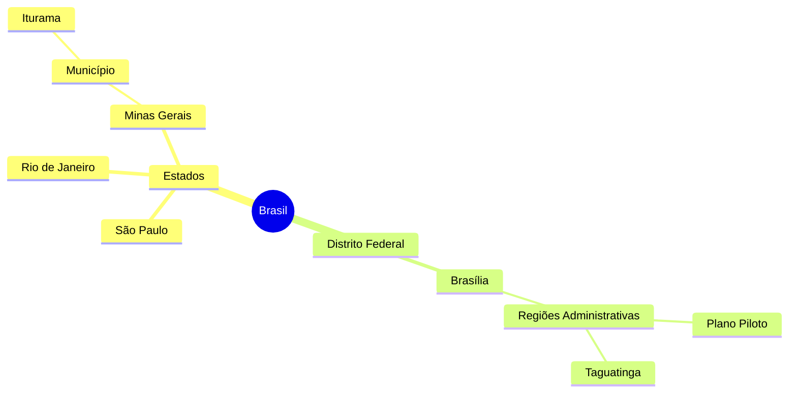

# brasil-estados-cidades-distritos

```mermaid
mindmap
  root((Brasil))
    Estados
      São Paulo
      Rio de Janeiro
      Minas Gerais
        Município
          Iturama
    Distrito Federal
      Brasília
        Regiões Administrativas
          Plano Piloto
          Taguatinga
```
