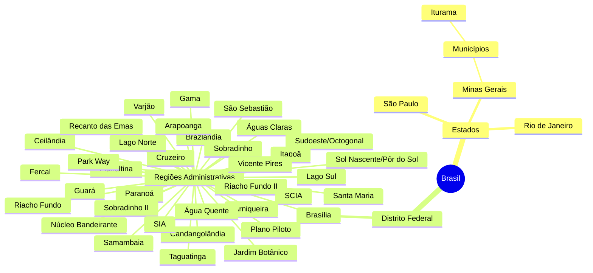

# brasil-estados-cidades-distritos

```mermaid
mindmap
  root((Brasil))
    Estados
      São Paulo
      Rio de Janeiro
      Minas Gerais
        Municípios
          Iturama
    Distrito Federal
      Brasília
        Regiões Administrativas
          Plano Piloto
          Gama
          Taguatinga
          Brazlândia
          Sobradinho
          Planaltina
          Paranoá
          Núcleo Bandeirante
          Ceilândia
          Guará
          Cruzeiro
          Samambaia
          Santa Maria
          São Sebastião
          Recanto das Emas
          Lago Sul
          Riacho Fundo
          Lago Norte
          Candangolândia
          Águas Claras
          Riacho Fundo II
          Sudoeste/Octogonal
          Varjão
          Park Way
          SCIA
          Sobradinho II
          Jardim Botânico
          Itapoã
          SIA
          Vicente Pires
          Fercal
          Sol Nascente/Pôr do Sol
          Arniqueira
          Arapoanga
          Água Quente
```
